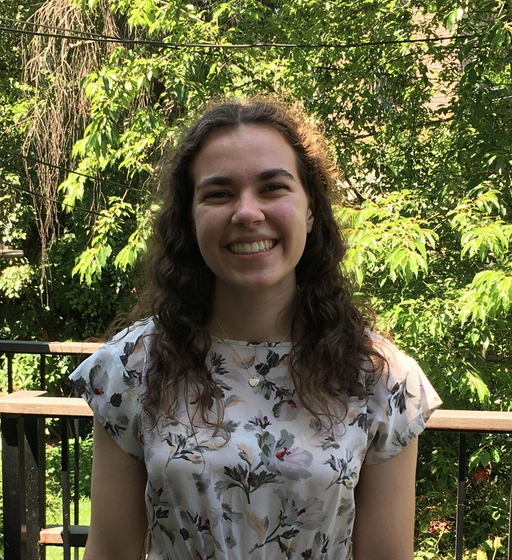

## About Me

I am a first year [Posse Scholar](https://www.possefoundation.org/about-posse) from Brooklyn, NY. I currently attend [Smith College](https://www.smith.edu/) as a full time student. Although I have not declared, I intend to double major in Government and Statistics and Data Science.

I graduated with honors from Midwood High School in Brooklyn, NY in 2019 with a GPA of 97.17. My current GPA at Smith is 3.6. 

My full resume can be accessed [here](resume.html).

## What am I doing now?

Currently I am a full-time student and I partake in volunteer and club activities. 
I am a tutor at Holyoke Homework House where I aid elementary school children in math, reading, and spelling. 

## My current classes are:

Intro to Stats

Intro to International Politics

Astronomy and Public Policy 

Communicating with Data

[List of Past Classes](classes.html)
